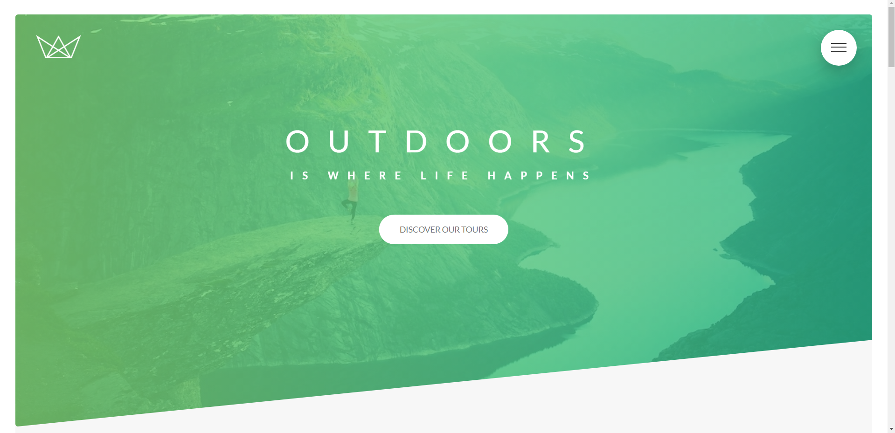
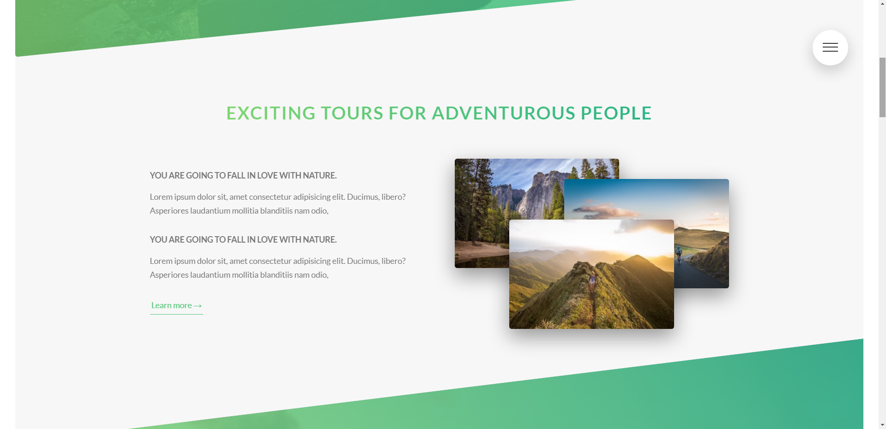
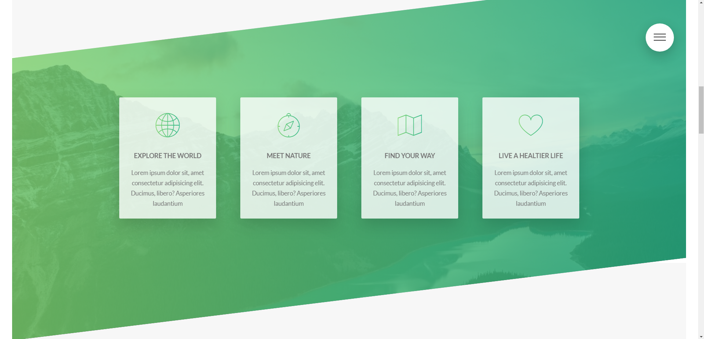
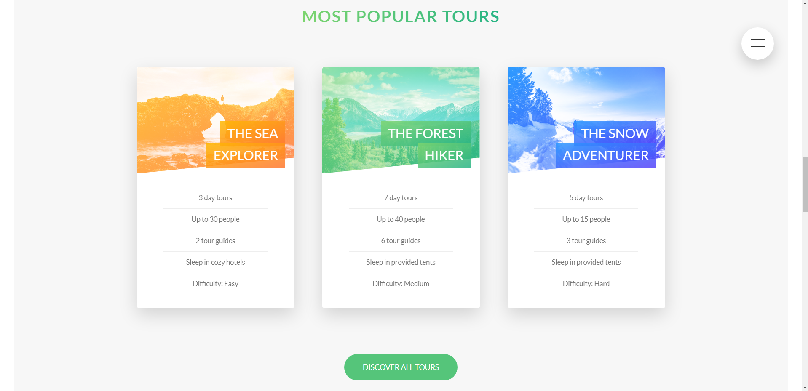
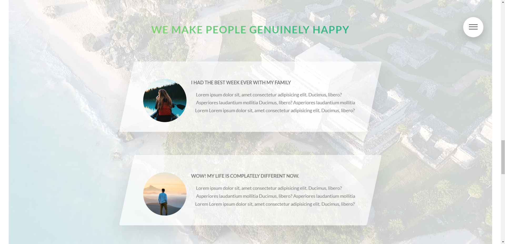
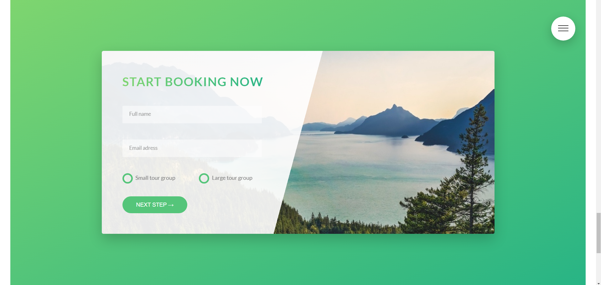
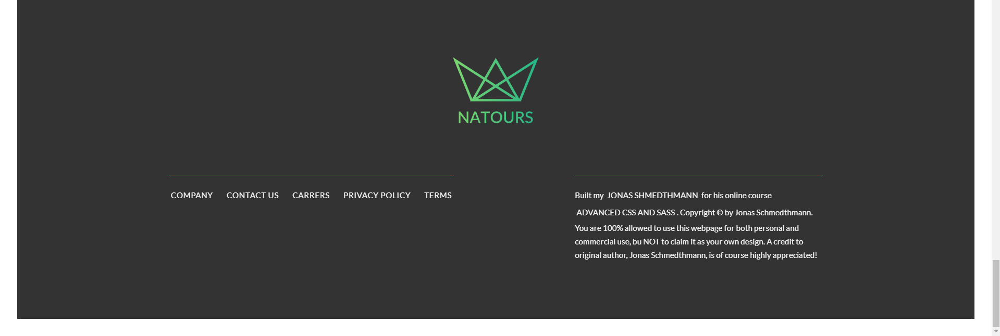
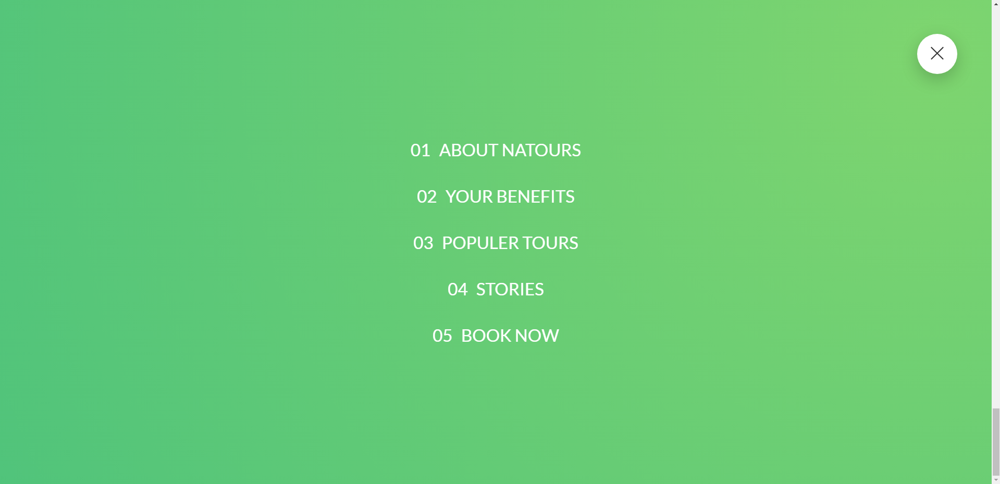
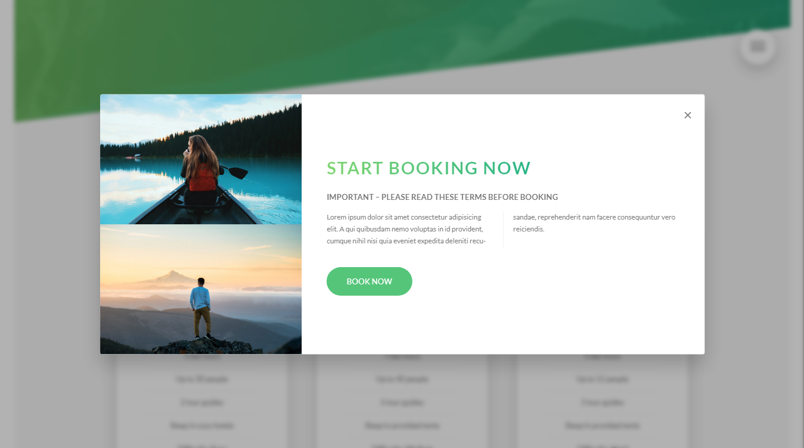

# <h1 align="center">🌳 NATOURS PAGE</h1>
## ❔ About project 
* In this project i build a nature tours page with **Jonas Schmedthmann**.
* Live version of Natours Page 🟢 ▶ <a href="https://natours-page-kadir.vercel.app/"> Natours-Page </a>

## 🧩 Structure 
* I used the **7-in-1 Sass** model to make it easier to develop and edit files.
* I used mixins for do not repeat code and easily include responsive breakpoints.
* I used scss files for variables and utilities which most used in project to don't repeat myself.
* Each component has its own file for easier access and development.
<!--  -->
##  CSS properties i used in this project
* **::before** / **::after** / **::selection** / **:not(:last-child)** / **:focus:invalid** / **:placeholder-shown** / **:checked** /  🔻🔺 pseudo-elements 
* skew / transform / translate / rotate / scale / perspective / clip-path / filter /
* @keyframes for animations
* Grid and float for positioning

##  CSS & SASS features i used in this project
* Hamburger menu 
* Image overlay
* On :hover skewed headers
* Clipped sections
* Flip card effect and modal
* Personalized radio buttons
* And other cool :hover effects
* Each image and icon has a lower quality version of itself. These images are used to increase performance for devices with smaller screens.

## 🛠 Technologies i used while creating the project :
    
<!-- -->

## <h2 align="center">HEADER SECTION</h2>

## <h2 align="center">ABOUT SECTION</h2>

## <h2 align="center">FEATURES SECTION</h2>

## <h2 align="center">TOURS SECTION</h2>

## <h2 align="center">STORIES SECTION</h2>

## <h2 align="center">BOOKING SECTION</h2>

## <h2 align="center">FOOTER SECTION</h2>

## <h2 align="center">NAVIGATION SECTION</h2>

## <h2 align="center">MODAL SECTION</h2>

## :phone: İletişim
 

   
<b> <samp> İletişime Geçin </samp></b>

    
   <samp>
   <b><h2 style="color: #fc6203">KADIR&nbsp;KARABACAK </h2></b>
   
      
     Projenin Linki: <a href="https://github.com/KadirKarabacak/Natours-Page">NATOURS PAGE</a>
      
      
     LinkedIn: <a href="https://www.linkedin.com/in/kadir-karabacak-/"> LinkedIn Hesabım</a>
      
     Instagram: <a href="https://www.instagram.com/kadir_krbck_/"> Instagram Hesabım</a>
      
     Mail Adresim: <a href="#"> kadirht@hotmail.com</a>
   </samp>
 

